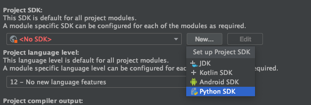

W celu przygotowania środowiska przed warsztatem wykonaj **wszystkie** kroki z poniższej instrukcji.

# Instalacja

0. Sklonuj to repozytorium: `git clone git@github.com:mikulskibartosz/BDDWorkshopInit.git`.

1. Zainstaluj Poetry: https://python-poetry.org/docs/#installation

2. Uruchom: `poetry update`. Zobaczysz taki rezultat:

```
Package operations: 30 installs, 0 updates, 0 removals

  - Installing attrs (20.3.0)
  - Installing markupsafe (1.1.1)
  - Installing pyrsistent (0.17.3)
  - Installing six (1.15.0)
  - Installing certifi (2020.12.5)
  - Installing chardet (4.0.0)
  - Installing click (7.1.2)
  - Installing idna (2.10)
  - Installing itsdangerous (1.1.0)
  - Installing jinja2 (2.11.3)
  - Installing jsonschema (3.2.0)
  - Installing parse (1.19.0)
  - Installing pyparsing (2.4.7)
  - Installing pyyaml (5.4.1)
  - Installing urllib3 (1.26.3)
  - Installing werkzeug (1.0.1)
  - Installing clickclick (20.10.2)
  - Installing flask (1.1.2)
  - Installing inflection (0.5.1)
  - Installing iniconfig (1.1.1)
  - Installing openapi-spec-validator (0.2.9)
  - Installing packaging (20.9)
  - Installing parse-type (0.5.2)
  - Installing pluggy (0.13.1)
  - Installing py (1.10.0)
  - Installing requests (2.25.1)
  - Installing toml (0.10.2)
  - Installing behave (1.2.6)
  - Installing connexion (2.7.0)
  - Installing pytest (6.2.2)
```

3. Jeśli używasz IntelliJ, dodaj środowisko virtualenv w projekcie:

* Otwórz katalog z tym projektem w Intellij i zaczekaj na zaindeksowanie projektu

* Ustaw `.venv` jako interpreter w IntelliJ:

  * File -> Project structure

  * Dodaj nowe SDK: 

  * Dodaj python3 z katalogu `.venv` jako interpreter Pythona 

5. Jeśli używasz innego IDE, również użyj `.venv` jako środowiska do uruchamiania 

# Testowanie konfiguracji

1. W głównym katalogu, uruchom: `poetry run behave`.

2. Oczekiwanym rezultatem jest:

```
Feature: The workshop website should contain correct data # features/scenario.feature:1

  Scenario: The workshop title contains BDD                          # features/scenario.feature:3
    When workshop website is retrieved                               # features/steps/stacjait.py:6 0.464s
    Then the title contains "Behavior Driven Development w Pythonie" # features/steps/stacjait.py:12 0.001s

1 feature passed, 0 failed, 0 skipped
1 scenario passed, 0 failed, 0 skipped
2 steps passed, 0 failed, 0 skipped, 0 undefined
```


3. W katalogu `test_api` uruchom `poetry run python3 app.py`

4. Otwórz w przeglądarce: `http://localhost:5000/api/test`

5. Jeśli widzisz poniższy rezultat to wszystko działa prawidłowo:

```
{
  "Hello": "World"
}
``` 
